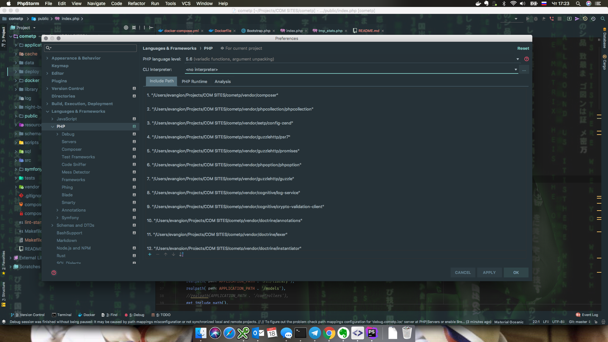
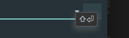
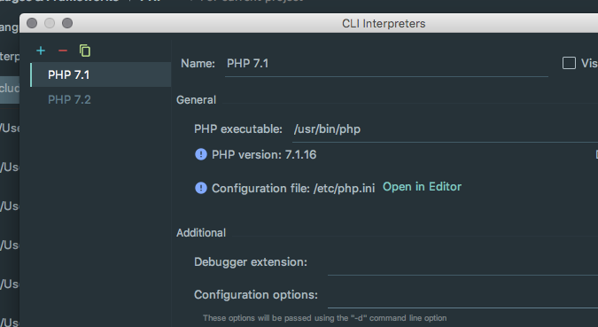
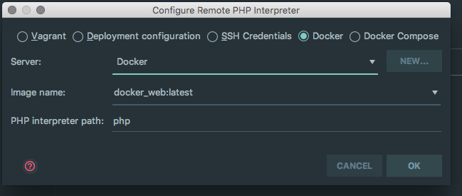
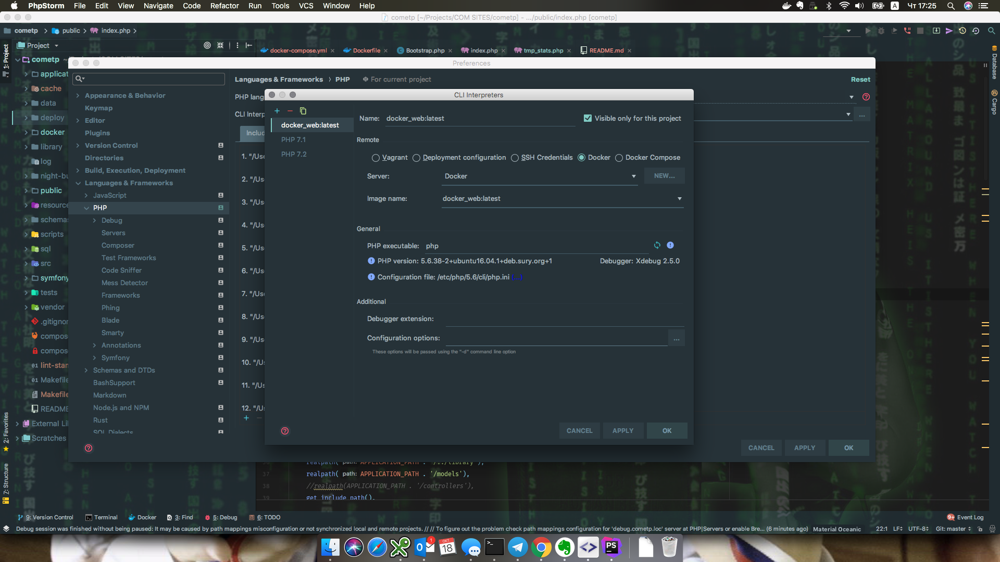
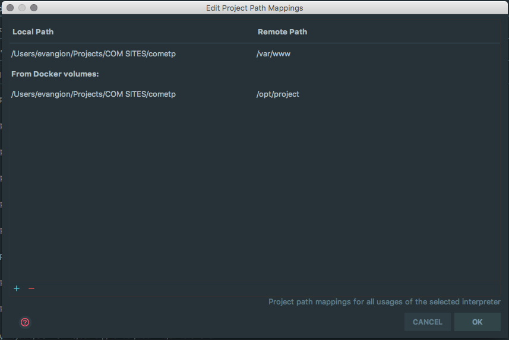
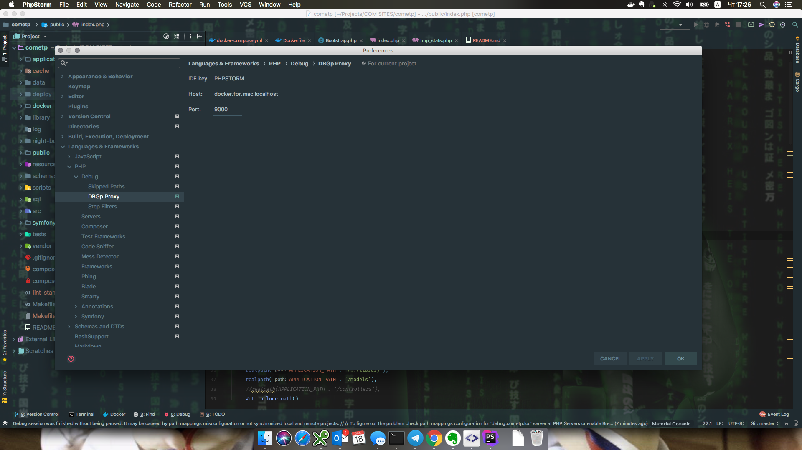
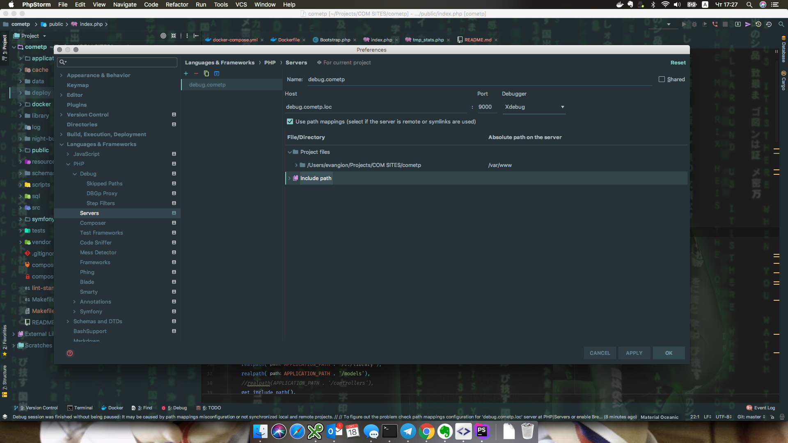

## Настройка XDebugger

Сначала настроим путь до интерпретатора РНР, для этого в настройках 
на скрине ниже

тыркаем кнопку около CLI Interpreter 

В открывшемся окне нажимаем плюсик 

Откроется новое окошко. Там выбираем радио-бутон Docker и если 
Server будет пусто - то New ну и там Docker (там думаю разберетесь)

В итоге должно получитья что-то типа такого

Нажимаете ОК и обновится информация о РНР. Появится третья строчка 
PATH Mappings, нажимаете три точки и в открывшемся окошке 
добавляете маппер на ваши рабочие файлы

Далее идет в настройки дебагера как на скрине ниже. Меняете только 
одно - ***Host*** - его берете из вашего ENV файла, который вы 
создавали в самом начале из шаблона 

Ну и на вкладке Server делаете настройки как ниже и 
маппите файлы на хосте в директорию в докер контейнере

